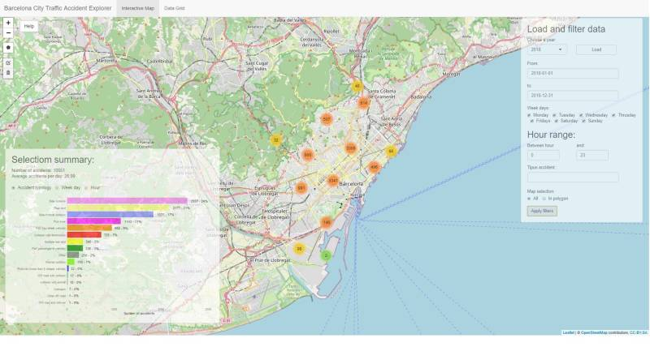
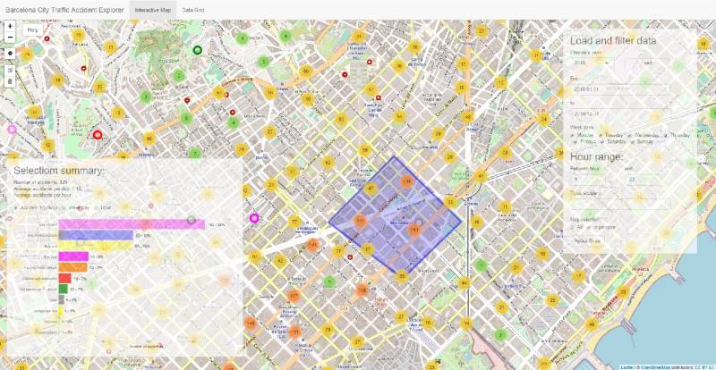

```{r setup, include=FALSE}
knitr::opts_chunk$set(echo = FALSE)
library(dplyr)
library(kableExtra)
```

## Barcelona's traffic accident explorer

 Shiny app that allows to explore Barcelona city traffic accidents through an interactive map.
 Main features are:
 
- Data download from Barcelona's open data service. 
- Interactive map, alows to navigate, filter and select data in user drawn polygon. 
- Summary of selected data, selected data is summarized showing daily average.
- Plots showing distribion by week day, hour range and typology of accident. 
- Data grid showing selected data.  


## Interactive map and summaries

When a data file is selected and filter applied over the interactive map a summaries panel is displayed showing the total number of accidents, the daily mean and one of three possible plots showing the accident typologies ans its weight over total accidents, a distribution in week days and a hourly distribution. 

```{r echo=TRUE, message=FALSE, warning= FALSE}
file2018 <- "./2018_accidents_tipus_gu_bcn.csv"
data <- read.csv(file2018, encoding="UTF-8", sep = ",")
n <- nrow(data)
data$Date <- as.Date(with(data, paste(Any, Mes, Dia_de_mes,sep="-")),
                   "%Y-%m-%d")
DataDaily <- data  %>% group_by(Date) %>% summarize(nacc = sum(n())) 
DailyMean <- round(as.numeric(DataDaily %>% summarise( mean(nacc))),2)
```

As example, total number for 2018 were `r n`  and a daily  was `r DailyMean`, as shown in next slide image.


## 2018 example



## Polygon selection
An interesting feature is the polygon selection. Allows to explore a specific zone.


## Slide with R Output

```

